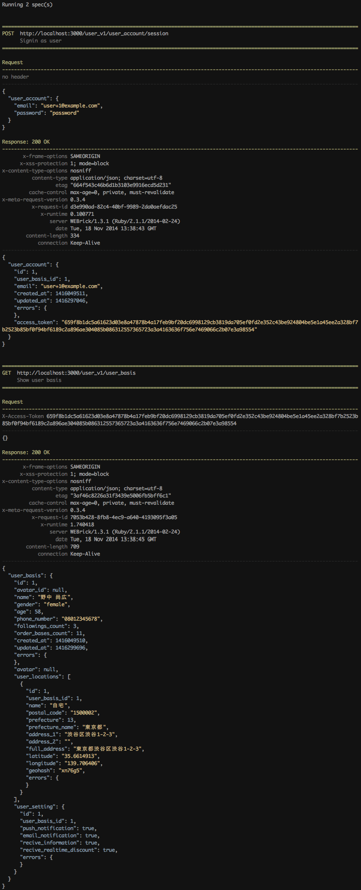

Herdic
======

**Herdic is a command line HTTP client intended to create and test API documentation with ease.**


Installation
------------

```sh
$ gem install herdic
```

Or add the gem to your Gemfile.

```ruby
gem 'herdic'
```


Sample
------

```yaml
# sessions/create.yaml

- title:    Signin as user
  method:   post
  endpoint: <%= config['api_base'] %>/user_account/session

  body:
    user_account:
      email:    <%= config['user_account']['email'] %>
      password: <%= config['user_account']['password'] %>

  register:
    user_account_access_token: user_account.access_token
```

```yaml
# user_bases/show.yaml

- include: ../sessions/create.yaml

- title:    Show user basis
  method:   get
  endpoint: <%= config['api_base'] %>/user_basis

  header:
    X-Access-Token: <%= registry['user_account_access_token'] %>
```

```sh
$ herdic user_bases/show.yaml
```




License
-------

This project is copyright by [Creasty](http://www.creasty.com), released under the MIT lisence.  
See `LICENSE` file for details.
